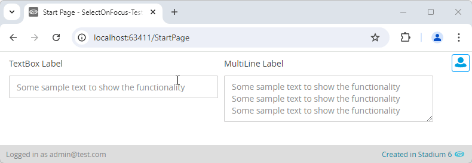

# Select Content On Focus

Sometimes may you want to select the contents of a TextBox when users click on the field or tab into it. This allows users to overwrite the contents of such a field without having to manually select the contents. This module implements this functionality. 



# Setup

## Global Script
1. Create a Global Script called "SelectOnFocus"
2. Drag a *JavaScript* action into the script
3. Add the Javascript below into the JavaScript code property
```javascript
/* Stadium Script v1.0 https://github.com/stadium-software/form-fields-content-select */
let allFields = document.querySelectorAll(".selectcontent input[type='text'], .selectcontent textarea");
for (let i = 0; i < allFields.length; i++) {
    allFields[i].addEventListener("focus", function (e) {
        e.target.setSelectionRange(0, e.target.value.length);
    });
}
```

## Page
1. Drag a TextBox to the page
2. Add the class "selectcontent" to the control class property

## Page.Load
1. Drag the "SelectOnFocus" script to the event handler